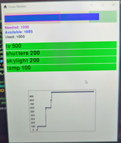
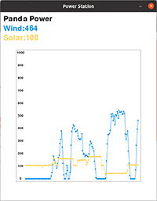

# Girsl Into Coding Renewal Energy Workshop
## Python code for data exchange with Microbit

This Python code acts as a conduit for data to pass from the house or power station to the respective microbits.

When run on the house it looks like this, showing the energy consumption of the house and the various devices attached:

When run on the powerstation it looks like this, showing the energy generated:

Uses the serial port to send data between the computer and the microbit.  Note that the microbit must be connected by a USB cable and NOT paired to the computer (e.g. through Makecode).

